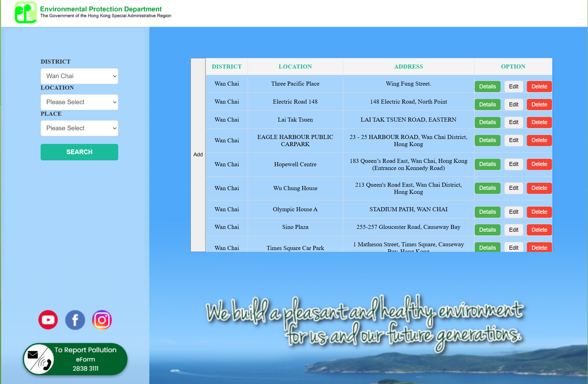

# ⚡ EV Charging Web Platform

A full-stack web application built for displaying electric vehicle (EV) charger information with interactive maps, filters, and admin features. Developed as part of university coursework.

---

## 🧩 Project Structure

awd/
├── frontend/ # Angular-based user interface
├── backend/ # PHP + database operations
└── data_process/ # Python data cleaning & transformation


---

## 💡 Features

- 📍 Interactive EV charger location map
- 📊 Filter by district, charger type, availability
- 🛠 Admin backend (add/remove/update chargers)
- 📁 Data preprocessing and cleaning pipeline
- 🧪 Basic CRUD with MySQL / SQLite backend

---

## 🖼️ Project Screenshots

### Home Page


### Map Page


---

## 🔧 Technologies Used

- **Frontend**: Angular, TypeScript, HTML/CSS  
- **Backend**: PHP, SQL  
- **Data Processing**: Python (pandas, etc.)  
- **Database**: MySQL / SQLite  
- **Map**: Leaflet.js / Google Maps API

---

## 🚀 Getting Started

```bash
# Frontend
cd frontend
npm install
ng serve

# Backend
Run PHP server inside /backend folder (e.g. XAMPP / WAMP)

# Data Processing
cd data_process
python your_script.py

👨‍💻 Author
Tong Wai Yin
📧 a2022938515@gmail.com
🌐 LinkedIn